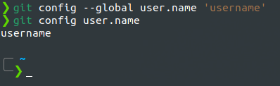
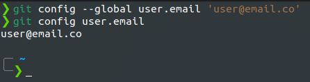

###### ____.section3_Installation&Setup

 

<!-- Table of Contents -->

### Table of Contents
- [Configuring your Git name and email](#configuring_your_git_name_and_email)
    - [git config --global user.name](#git_config_--global_user.name)

 
 

# Configuring your Git name and email

## Git Name Configure
## git config --global user.name 'username'
* Configuring your git credential username.

## git config user.name
* Prints current configured username credential.

#### Example

 
 

## Git Email Configure
## git config --global user.email 'user@email.co'
* Configuring your git credential email.

## git config user.email
* Prints current configured username credential.

#### Example

