###### ___.linux_commandList

## Linux Command Table

|**Expansion Parameters/ Useful Syntax**|**General Desciption**|
|:---:|:---|
|$ glENV/shENV  $(Command Substitution)|Basically known as command substitution, it can be used when calling enviroment variables within other commands as an example echo "Hello $USER" of if you wish to see your enviroment path you can call it on its own like so $PATH, it can also be used for mathemtical equations echo "$((2+3))"|
|#! Shebang|Known as Shebang, is generally used within scripts, and generally the first line of the as an example #!/bin/bash which essentially is telling the os which interpreter/language to use to read this file other vairant can be #!/bin/python3 or #!/bin/perl|

 

|**Wildcards/Globbing Patterns**|**General Description**|
|:---:|:---|
| * | matches any character or set of characters, including no character. For example, O*d matches anything that begins with O and ends with d (like Oind, Okhd, Oerd, Oereed, Oad, Oerererd, Od, Oarmeerrd). The number of characters in between O and d is not important.|
|[]|match characters enclosed in square brackets. For example, O[ac]d matches only Oad and Ocd. You can also specify a range of values: O[a-e]d matches Oad, Obd, Ocd, Odd and Oed.|
|?|matches a single character. For example, O??d matches anything that begins with O, ends with d and has two characters in between (like Oind, Okhd, Oerd, but not Oereed, Oad, Oerererd.)|
|{}|Curly brackets are used for multiple matches.  Each string can be an exact name, or a wildcard. It will find anything that matches any of the given strings using an or relationship (one OR the other).|

 

## man

### Description
* shows manual for specified commands.

### Useful Options
* 

#### Example

 
 

## date

### Description
* The print command prints the current.

### Useful Options
* +%a-..
* %b-..
* %Y..

### Ways To Use
* date +%a-%b-%Y

#### Example

 
 

## ncal/cal

### Description
* cal or ncal which stands for calendar or new calendar peints the current months calendar.

### Useful Options
* **_-A #NUM_** prints the specifed number of months after the current month
* **_-B #NUM_** prints the specifed number of months before the current month
* **_-M_** prints the calendar starting monday

#### Example

 
 

## echo

### Description
* The echo command echos back input, either in the form of a command or string/text.

### Useful Options
* -e to run extended expressions
* $(command) used for command substitution.

#### Example

 
 

## type

### Description
* The type command shows us what the command is for example:
    * /bin usr/bin or /usr/local/bin.
    * shell built-in.
    * shell function.

### Useful Options
* 

#### Example

 
 

## which

### Description
* To find the exact location of an executable, run which command. This only works for executables, not built-in shell commands or aliases.

### Useful Options
* 

#### Example

 
 

## help

### Description
* The help command prints documentation for those commands that do not have man pages.

### Useful Options
* 

#### Example

 
 

## pwd

### Description
* The pwd Command prints the current working directory, in other words the current directory your terminal is located in.

### Useful Options
* 

#### Example

 
 

## ls

### Description
* ls list the specified directory or current directory's contents.

### Useful Options
* -l use a long listing format, not only that but also be default shows the mtime, basically the last modified time.
* -a lists all contents including hidden files or files that start with.
* -S or --sort=word (size, type, version, extension) sorts the list via a specified need.
* -h or --human-readable makes file sizes easier to read.
* -R or --recursive list subdirectories recursively, almost like tree view.
* -1 list one file per line.
* -u shows and sorts bby last access time.

#### Example

 
 

## cd

### Description
* The cd command changes your directory through the terminal allowing you to move from folder to folder or directory to directory.
* You get two forms of moving around, which be best explained as **_relative paths_** which are insight of your current directory and **_absolute paths_** which are paths outside of your sight or relative path, and example of this is going from your user folder to another users home folder.

### Useful Options
* 

#### Example

 
 

## touch

### Description
* The touch command does two things, that is when touching an exiting command, you essentially just updating the timestamp on that particular file without  actually opening it.
* The other is to create a new file, considering there is no file with that particular name.

### Useful Options
* 

#### Example
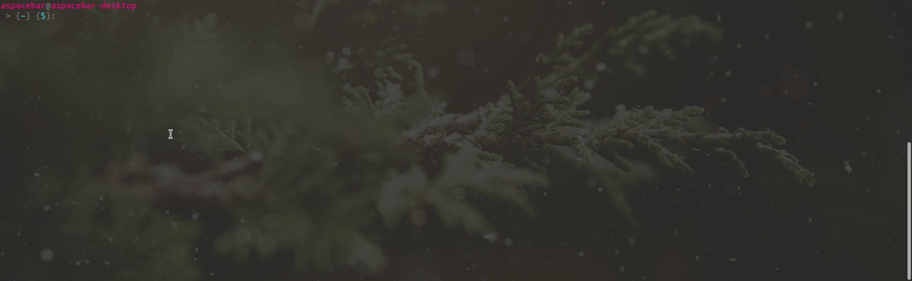

 
 

## file

### Description
* The file command shows the type of file a file is, even if the file does not have a specified .format or extension.

### Useful Options
* 

#### Example

 
 

## mkdir

### Description
* mkdir makes directories

### Useful Options
* **_-P or --parents_** is for make directories and sub-directories.
* **_-m | --mode_** sets the mode (as in chmod) of the file.
* **_-v | --verbose_** prints out what it has done.

#### Example
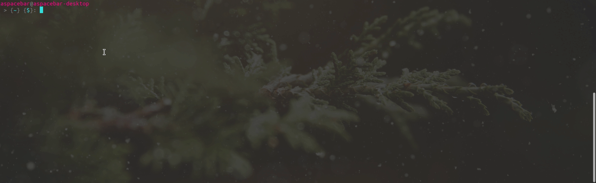

 
 

## nano

### Description
* The nano command is basically a in terminal text editor, like this touch command you can create files with nano as well.

### Useful Options
* 

#### Example

 
 

## rm

### Description
* The rm Command removes files and folders.

### Useful Options
* **_-d or --dir_** remove empty directories
* **_-r, -R or --recursive_** remove directories and their contents recursively
* -f force 
* -i 
* -v 

#### Example

 
 

## mv

### Description
* The mv command moves files and directories from one place to another.
* The mv command can also be used to rename a file or directory considering it stays in the same directory when using the command.

### Useful Options
* 

#### Example
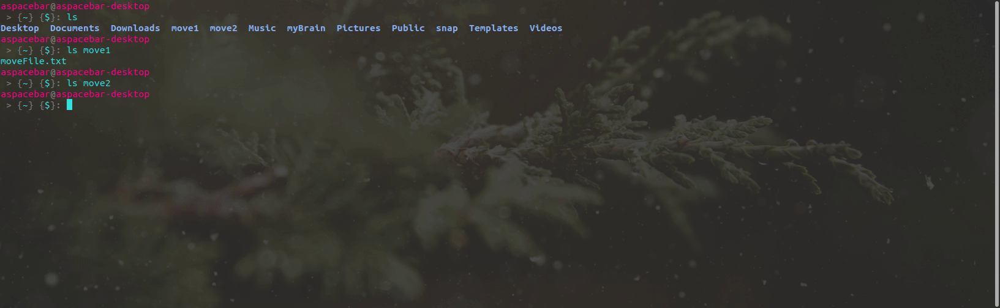

 
 

## cp

### Description
* The cp command copies files and or directories from one postion to another.

### Useful Options
* 

#### Example
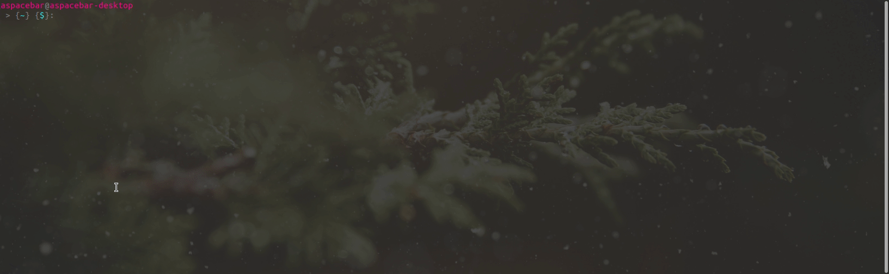

 
 

## less

### Description
* The less command displays the contents of a file, one page at a time.
* less is basically a program, which allows you to view files in a controlled manner, whereby you can search and many other things.
    * It also declutters your terminal.

### Useful Options
* 

#### Example

 
 

## cat

### Description
* The cat command con cat enates and prints the contents of files. If we provide cat with multiple files, it will concatenate their contents and output them.

### Useful Options
* 

#### Example

 
 

## tac

### Description
* tac (cat spelled backwards) will concatenate and print files in reverse. It prints each line of a file, starting with the last line. You can think of it as printing in reverse "vertically"

### Useful Options
* 

#### Example
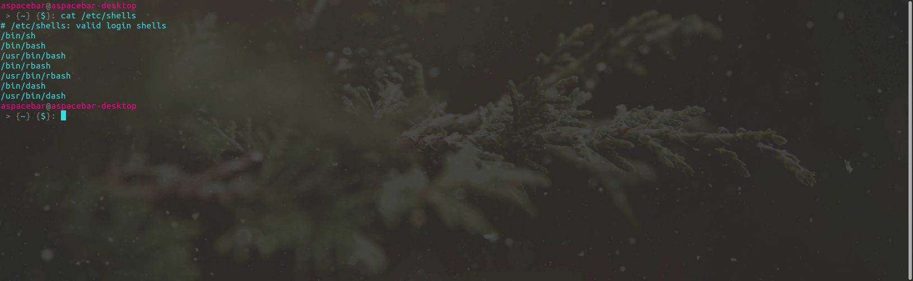

 
 

## rev

### Description
* the rev command prints the contents of a file, reversing the order of each line. Think of it as a "horizontal" reverse, whereas tac is a "vertical" reverse.

### Useful Options
* 

#### Example
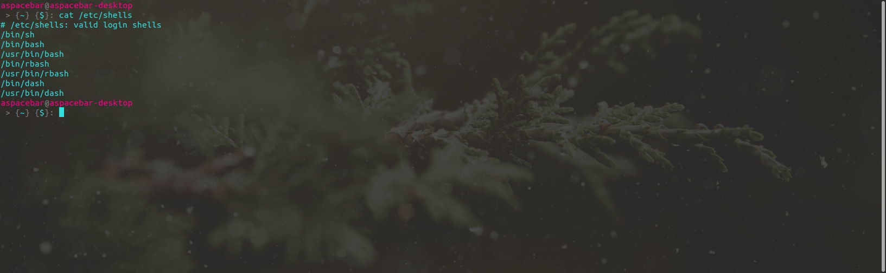

 
 

## head

### Description
* The head command prints a portion of a file, starting from the beginning of the file. By default, it prints the first 10 lines of a file.

### Useful Options
* **_-n or --lines_** prints the specified number of lines for head to print.
* **_-c_** print the number of bytes rather than lines.

#### Example

 
 

## tail

### Description
* The tail command works similarly to the head command, except it prints from the END of a file. By default, it prints the last 10 lines of a file.

### Useful Options
* **_-n_** same as head.
* **_-c_** same as head.
* **_-f_** output appended data as the file grows.

#### Example

 
 

## wc

### Description
* The word count command can tell us the number of words, lines, or bytes in files. By default, it prints out three numbers: the lines, words, and bytes in a file.

### Useful Options
* -l prints the amount of lines only
* -w prints the amount of words only

#### Example

 
 

## sort

### Description
* The sort command outputs the sorted contents of a file (it does not change the file itself). By default, it will sort the lines of a file alphabetically.

### Useful Options
* **_-r_** sorts file in reverse order.
* **_-n_** sorts file in numerical order.
* **_-u_** sorts only the unique values, The -u option tells the sort command to ignore duplicates and instead only sort unique values
* **_-k_** sort file specified columb

#### Example

 
 

## tr

### Description
* Translate, squeeze, and/or delete characters from standard input, writing to standard output.

### Useful Options
* -d --delete delete characters in SET1, do not translate
* [:aplha:] all letters
* [:digit:] all digits
* [:space:] all horizontal or vertical whitespace
* [:blank:] all horizontal whitespace
* [:lower:] all lower case letters
* [:upper:] all upper case letters

#### Example
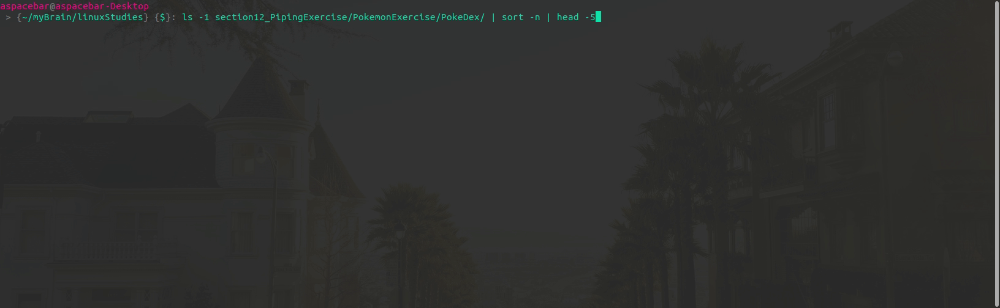

 
 

## locate

### Description
* The locate command performs a search of pathnames across our machine that match a given substring and then prints out any matching names. 
* It is nice and speedy because it uses a pre-generated database file rather than searching the entire machine.

### Useful Options
* -e option will only print entries that actually exist at the time locate is run.
* -i option tells locate to ignore casing
* -l or --limit option will limit the number of entries that locate retrieves.

#### Example
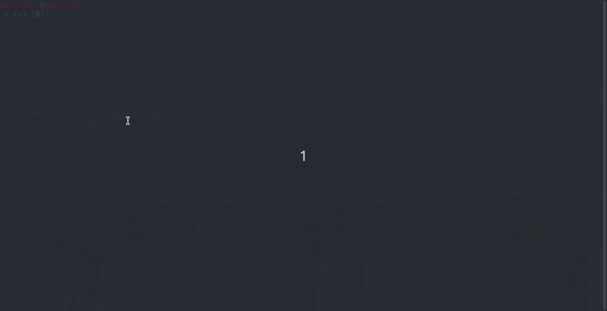

 
 

## updatedb

### Description
* updatedb  creates  or  updates  a  database  used by locate(1).  
* If the database already exists, its data is reused to avoid rereading directories that have not changed.

### Useful Options
* -v | --verbose Output path names of files to standard output, as soon as they are found.

#### Example

 
 

## find

### Description
* By default, find on its own will list every single file and directory nested in our current working directory.
* We can also provide a specific folder. find friends/ would print all the files and directories inside the friends directory (including nested folders)
    * **Timestamps** 
        * mtime, or modification time, is when a file was last modified AKA when its contents last changed.
        * ctime, or change time, is when a file was last changed. This occurs anytime mtime changes but also when we rename a file, move it, or alter permissions.
        * atime, or access time, is updated when a file is read by an application or a command like cat.
    * **Logical Operators**
        * (and, or not) works the same as all logical operators

### Useful Options
* -type -f (will limit search to only files) 
    * or -type -d (limit search only to directories)
* -name "input *?[]" searches by name
* -iname "input *?[]" is the same but is case insensitive
* -size 
    * +1G (gigabytes)
    * -10M (megabytes)
    * 1033c (bytes)
    * 100k (kilobytes)
* -user finds users, for example find -user Harry will find all files that belong to that particular person
* -empty finds all the empty files
* -newer reference Time  of the last data modification of the current file is more recent than that of the last data modification of the reference file.
* -exec command '{}' ';' executes a command after find said files or folders, however this does not ask for permission or verification first, so using this to delete is quiet dangerous
* -ok command '{}' ';' same as exec just it verifies each file
* | xargs When we provide a command via -exec , that command is executed separately for every single element. We can instead use a special command called xargs to build up the input into a bundle that will be provided as an argument list to the next command.

### Timestamps
* -mmin n finds last modified files in specified n time
* -amin n finds last accessed time files in specified n time
* -cmin n finds last changed files in specified n time
* -mtime n24h last modified files in periods of 24 hours
* -atime n24h last accessed files in periods of 24 hours
* -ctime n24h last changed files in periods of 24 hours

### Logical Operators
* -and is technically always implied, but there might be some use case where you need to use it
* -or as an example find -name "Harry" -or find -name "Ron"
* -not find whatever specified but not or excluding specified as an example find -name "Harry.txt" -not -name "Harry.html"

#### Example

 
 

## uniq

### Description
* report or omit repeated lines

### Useful Options
* -c --count prefix lines by the number of occurrences

#### Example
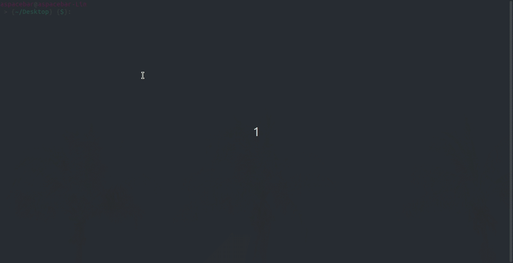

 
 

## grep

### Description
* Unlike the find command, grep searches within a files contents for a specified pattern.
    * An example is something like **_grep "chicken" animals.txt_** which will search for the word chicken within the file
* The grep command also contains something called regex or regular expressions as well as extended expressions which can be found here for more info [Learn Regex](https://regexone.com/ "Learn more about regex").

### Useful Options
* -i case insenstive search
* -w for word search
* -r recursive search through multiple files
* -c for counting how may times that pattern shows up
* -n for showing line numbers
* -m limit search the first specified amount
* -o print out the matches, rather than the entire line containing each match.
* -A(n) specified amount after specified pattern found
* -B(n) specified amount before specified pattern found
* -C(n) prints the context around specified pattern
* -E -to use extended regular expressions

### Regex /_Regular Expressions_ 
* . - matches any single character
* ^ - matches the start of a line
* $ - matches the end of a line
* [abc] - matches any character in the set
* [^abc] - matches any char NOT in set
* [A-Z] - matches characters in a range
* * - repeat previous expression 0 or more times
* \ - escape meta-characters

### Extended Regex /_Extended Regular Expressions_

#### Example

 
 

## chmod

### Description
* chmod stands for change mode or to be more exact change file mode bits.
* chmod changes the file mode bits of each given file according to mode, which can be either a symbolic representation of changes to make, or an octal number representing the bit  pattern  for  the new mode bits.
    * Symbolic Expressions 
    * symbolic expressions are represented with letter and symbols as so
        * chmod [ugoa +-= rwx] file
    * Octal Numbers 
    * Octals are linked to whats known as binary, they are represented with numbers, whereby each number represents a binary as so
        * chmod [700] file
* Permissions/Modes affect files and directories differently. An example if a folder does not have an x mode, the user cannot cd into said directory or folder, however if it did have the r mode, the user can ls the directory to see its contents.

### Useful Options
### Symbolic Expressions
* u -user/owner
* g -group
* o -world
* a -all
* + -add
* - -revoke/remove
* = -set only/ removes previously set modes/permissions
* r -read
* w -write
* x -execute

### Octal Numbers
* Octal Num 0 
    * Binary Num 000
        * File Mode ---
* Octal Num 1 
    * Binary Num 001
        * File Mode --x
* Octal Num 2 
    * Binary Num 010
        * File Mode -w-
* Octal Num 3 
    * Binary Num 011
        * File Mode -wx
* Octal Num 4 
    * Binary Num 100
        * File Mode r--
* Octal Num 5 
    * Binary Num 101
        * File Mode r-x
* Octal Num 6 
    * Binary Num 110
        * File Mode rw-
* Octal Num 7 
    * Binary Num 111
        * File Mode rwx

#### Example

 
 

## chown

### Description
* chown changes the user and/or group ownership of each given file as follows: 
    * **_chown user:group file_**

### Ways To Use
* chown user file -this changes the owner of the file
* chown :group file -this changes the group of the file
* chown user:group file -this changes both the owner and group of said file

### Useful Options
* 

#### Example

 
 

## groups

### Description
* print the groups a user is in

### Ways To Use
* groups -this shows the current logged in users groups
* groups user -this shows the specified users groups

### Useful Options
* 

#### Example

 
 

## addgroup | adduser

### Description
* adduser and addgroup add users and groups to the system according to command line options and configuration information in /etc/adduser.conf.  They are friendlier front ends to the low level tools like useradd, groupadd and  usermod  programs,  by default choosing Debian policy conformant UID and GID values, creating a home directory with skeletal configuration, running a custom script, and other features.

### Ways To Use
* adduser and addgroup can be run in one of five modes:
    * Add a normal user
        * adduser username
    * Add a system user
        * 
    * Add a user group
        * addgroup groupname
    * Add a system group
        * 
    * Add an existing user to an existing group
        * adduser username groupname

### Useful Options
* 

#### Example

 
 

## delgroup | deluser

### Description
* deluser and delgroup remove users and groups from the system according to command line options and configuration information in /etc/deluser.conf and /etc/adduser.conf.  They are friendlier front ends to the userdel and groupdel  programs,  removing the  home  directory as option or even all files on the system owned by the user to be removed, running a custom script, and other features.

### Ways To Use
* deluser and delgroup can be run in one of three modes:
    * Remove a normal user
        * deluser username
    * Remove a group
        * delgroup groupname
    * Remove a user from a specific group
        * deluser username groupname

### Useful Options
* 

#### Example

 
 

## su

### Description
* run a command with substitute user and group ID

### Ways To Use
* su username -This substitutes another user, not the same as logging in as another user
* sudo su -substitutes the root user, once again not the same as logging into as root

### Useful Options
* 

#### Example

 
 

## sudo

### Description
* sudo allows a permitted user to execute a command as the superuser or another user, as specified by the security policy.

### Ways To use
* sudo apt update && sudo apt upgrade
* sudo su
* etc ...

### Useful Options
* 

#### Example

 
 

## printenv

### Description
* print all or part of environment

### Useful Options
* 

#### Example

 
 

## source

### Description
* Execute commands from a file in the current shell. 
* Read and execute commands from FILENAME in the current shell. The entries in $PATH are used to find the directory containing FILENAME. 
* If any ARGUMENTS are supplied, they become the positional parameters when FILENAME is executed.

### Ways To Use
* source .bashrc or .profile

### Useful Options
* 

#### Example
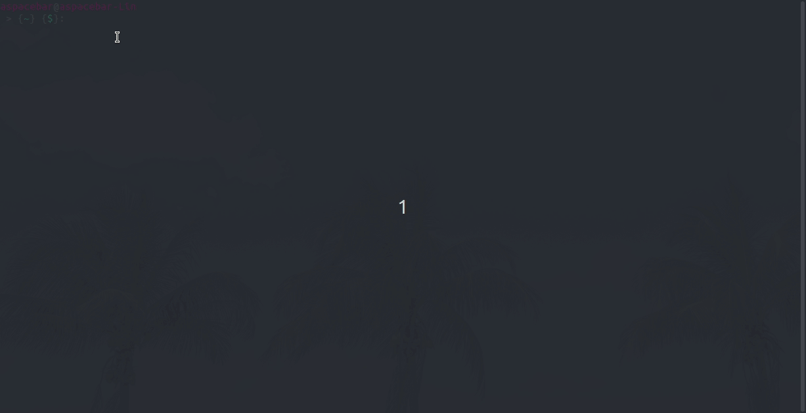

 
 

## crontab

### Description
* 

### Cron Syntax

|min|hour|dom|mon|dow|command|
|:---:|:---:|:---:|:---:|:---:|:---:|
|0-59|0-23|1-31|1-12|0-6|command /path/ |

### Cron Characters
* (*) Any Value aka Every minute, Every hour, Every Day ...
* 5,6 List of values others can be seen as (5 and 6)
* 1-4 Range of values (1 to 4)
* */5 Step Values (Every 5 minutes)

### Ways To Use
* 

### Useful Options
* -e used to open and edit the crontab file, also the recommended way.

#### Example
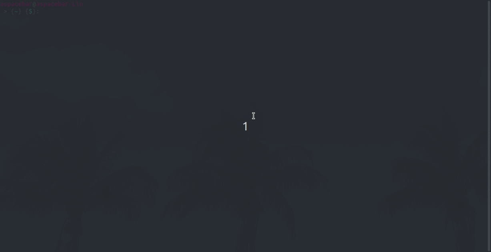

 
 

## tar | .tar.gz

### Description
* tape archive

### Ways To Use
* 

### Useful Options
*  -c | --create Create a new archive.  
* -v Verbose
* -z compression method (gzip)
* -f filename
* -x | --extract Extract files from an archive.

### Ways To Use
* tar -cvzf filename.tar.gz theFile/ --> This compresses and makes a tar file.
* tar -xvzf filename.tar.gz --> Extracts the file.
    * very important to had the **-z** option even when extracting to tell tar which file compression it was.

#### Example

 
 

## command

### Description
* 

### Useful Options
* 

#### Example

