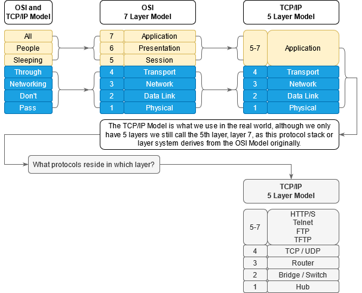
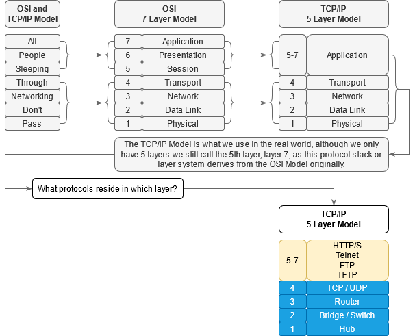
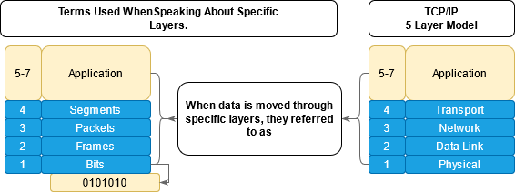
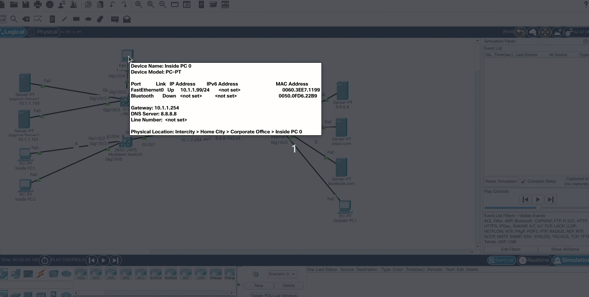
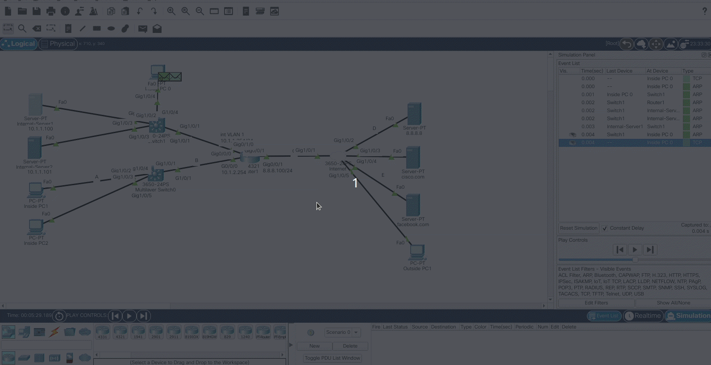
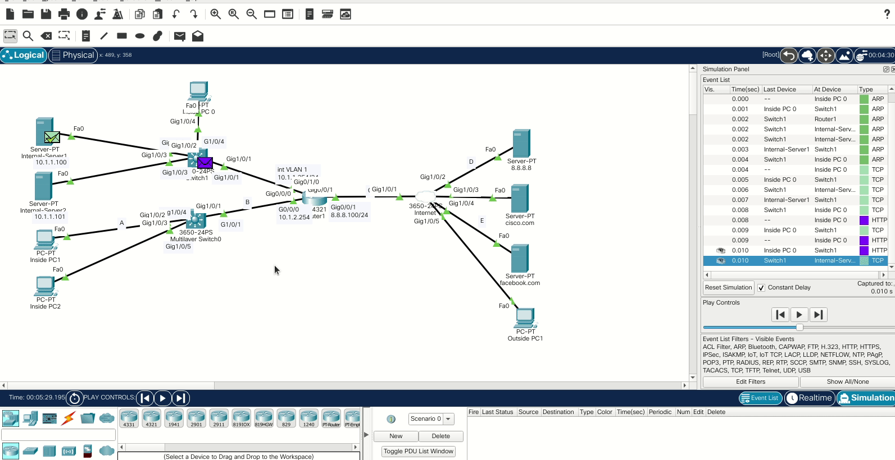
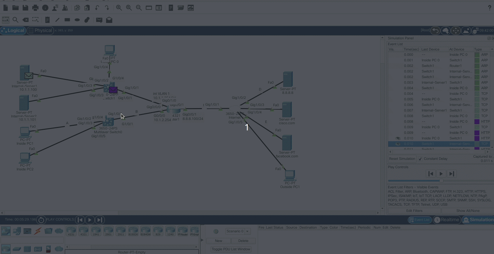

###### - TCP/IPModel

 

<!-- Table Of Contents -->

### Table Of Contents
- [OSI and TCPIP Model](#osi-and-tcpip-model)
    - [Open Systems  Interconnection and Transmission Control Protocol & Internet Protocol](#open-systems-interconnection-and-transmission-control-protocol-and-internet-protocol)
    - [What Protocols Reside In Which Layer?](#what-protocols-reside-in-which-layer)
- [Practical TCPIP Model Part 1](#practical-tcpip-model-part-1)
    - [IP](#ip)
    - [Bits](#bits)
- [Practical TCPIP Model Part 2](#practical-tcpip-model-part-2)
    - [The ARP Packet](#the-arp-packet)
    - [TCP Protocol or 3 way hand shake](#tcp-protocol-or-3-way-hand-shake)
    - [HTTP Packet](#http-packet)
- [Practical TCPIP Model Part 3](#practical-tcpip-model-part-3)
    - [Port Numbers](#port-numbers)
    - [Well Known Ports](#well-known-ports)
- [Practical TCPIP Model Part 4](#practical-tcpip-model-part-4)

 
 

# OSI and TCPIP Model
## Open Systems Interconnection and Transmission Control Protocol and Internet Protocol
* How many layers are in networking?
    * what are they and why are they important?
* Below show a depictition of what is know as the OSI and or TCP/IP Model system.

 

 

* The OSi Model and TCP/IP Model are taking what is known as a Protocol Stack and neatly organising them on there own layer.
    * Note that its not always as clear cut as what the image above makes it seem, especially in the OSI or Open System Interconnection model makes it seem.
* Getting to why we have models, is because we taking complex problems and breaking them up into small pieces.
* The layers we as networking people concentrate on are the lower 4 layers, or otherwise known as
    * Transport
    * Network
    * Data Link
    * Physical
* Note that the TCP/IP Model is the more realistic model now a days, though looking at the OSI and TCP/IP models, you will notice that the TCP/IP Model combines layers 5 to 7 as Applications however it is still known as Layer 7 even though the TCP/IP Model only has 5 Layers.
    * This is partly due to convention but also because the combining the OSI model into the TCP/IP model.
* So reittereating as networkers we focus on the first 4 layers and then layer 7 which is the combined applications layer.

## What Protocols Reside In Which Layer?

 

 

# Practical TCPIP Model Part 1
## Bits, Frames, Packets, Segments and More

## IP
* An ip address is a number you give a device to allow it to communicate through a protocol such IP or Internet Protocol, as an example connecting to you home router with an ip address, essentially a device.

* There is some terms when it comes to talking about "stuff" on specific layers in the TCP/IP Model shown in the image below.
        
 

 

## Bits
* When sending data on the physical layer, we sending 0s and 1s known as **_Bits_**. 
    * So the bits of data on a fiber cable is represented as light. 
        * --> If there is light its a 1 if there is no light its a 0, 
    * Whereas the bits of data on a copper cable is represented as electricity.
        * --> If there is electricity then its a 1, If there is no electricity then its a 0
    * so 0s and 1s would represent our bits, or binary values.

 

# Practical TCPIP Model Part 2
## HTTP captures

* On ethernet devices communicate using whats called a MAC address or Media Access Control Address.
    * A MAC Address is a burnt in address on a NIC or Network Interface Card.

## The ARP Packet
* In our dipology we trying to connect to a server with an ip address of 10.1.1.100, before we can establish a connection with the specified ip address in our local network, we need do what is known as an Address Resolution Protocol or ARP Request. 
    * In the gif below we see that we entered th ip address in our client browser and the ARP packet was created.

 

 

 

* The purpose of ARP is to understand to which device the client pc need to connects to.
    * Its basically requesting the MAC Address of the server we trying to connect to, So in other words its asking which MAC Address has this ip?
* That frame gets sent to the switch as seen below as a broadcast on layer 2

 

 

* So that request gets sent to the switch which is a layer 2 device, 
    * Notice the destination is FFFF.FFFF.FFFF which is known as a broadcast and is a layer 2 frame, so broadcast frame, that gets sent to the switch which is again a layer 2 device and that requests then basically floods the device or ports requesting that ip address.
* When looking at the PDU or Protocol Data Unit, we see that Target MAC Address is 0000.0000.0000 and the Target IP Address is 10.1.1.100.
* The broadcast frame floods the layer 2 device in other words the switch and when looking at the Router which has an IP of (10.1.2.254/24) and Server 2 (10.1.1.101) both drop the packet.
    * Whereas Server 1 will reply back.
* When looking at Server 1 The inbound PDU shows the broadcast packet FFFF.FFFF.FFFF from the client pc, though the outbound PDU now shows the reply from the server with said MAC address replying to the client PC.
    * That then gets sent back to the switch and from the switch back to the client pc. The client pc now knows the mac address of the server.

## TCP Protocol or 3 way hand shake
* After the ARP Request has been made, it then sends out a TCP protocol.
* In TCP before any communication takes place, they do what is called a 3 way handshake as seen below

 

 

* Basically they are agreeing on certain parameters such as sequence numbers or how much data they can send and then a HTTP Packet is sent into the network.

## HTTP Packet
* When looking at the HTTP packet, we see a specific interface recieves that frame gig1/0/4 which is a physical port and the is then forwarded out the port gig1/0/2.

 

 

* We then look at the Inbouned PDU and see  the source address and the destination address, we also see something called TYPE:0x0800 and that brings us to the question of, How does one layer communicate with another?
    * So at layer 2 on ethernet it uses a what is known as a TYPE field followed by a hexadecimal such as 0x0800 or 0x0806.
* The hexadecimal number 0x0800 seen in the PDU TYPE field is indicating that the higher layer protocol is IPv4 or located in the IPv4 protocol stack.
    * We can have other protocol stacks as well, as an example, if we go back and look at the ARP Request you will see that the TYPE field is 0x0806 which indicates that the higher protocol layer can be found in the IPv6 protocol stack.
* When a device recieves a frame at layer 2 it needs to know which protocol to use. In other words which protocol stack to use.
* When the Server receives the HTTP packet, it will know that it needs to use the IPv4 Protocol Stack based on the TYPE field.
* In this example, The TYPE:0x0800 or IPv4 is the layer 3 protocol.
    * And you can see the IPv4 source and destination ip address.
* Now we repeat the question again, How does it know which protocol is being used at layer 4, 
    * ethernet was the layer 2 encapsulation.
    * IPv4 Was the layer 3 Protocol.
    * TCP is the layer 4 Protocol.
        * And we know this because we see the PRO:0x06 hexadecimal number which relates to TCP whereas 0x017 relates to UDP
            * You can see more IPv4 Protocols [Here](https://www.iana.org/assignments/protocol-numbers/protocol-numbers.xhtml "IPv4 Protocol List")

## TCP and UDP
* TCP --> Transmission Control Protocol --> Reliable
* UDP --> User Datagram Protocol --> Unreliable 

 

# Practical TCPIP Model Part 3
## Port Numbers

* So we know that networkers work with the first 4 layers Physical, Data Links, Network and Transport, However we also know that the TCP/IP model includes a 5th layer known as layer 7 Applications layers. We although originally dealt with 4 layers, we do talk about the 5 layer or 7th layer for convention of the OSI Model. 
    * How do we take a look at the layer 7 Protocol?

 

 

* The layer 7 Protocol can be seen in the Transport layer or layer 4 or TCP layer under DESTINATION(Dst) PORT:80 
    * Port 80 is known as HTTP and we are indicating the application we want to send via the port number.
        * This is also known as a well known port.
    * Servers with the service of HTTP will be listening on port 80 for incoming requests, So when sending an HTTP Packet, The DESTINATION(Dst) PORT will be 80, indcating to the server which application to send that request to.
* As the Packet reaches the server we see another port listed as 1025
    * There are different ports assigned for different things, as an example well known ports, ephemeral/random ports and so ..
        * A server is always listening on well known ports, however if you are creating a session to that server you are using what is known as a ephemeral or random port number.
* On the IANA [Site](https://www.iana.org/assignments/service-names-port-numbers/service-names-port-numbers.xhtml?&page=1) You see that there are 3 categories, System Ports, User Ports and Dynamic/ Private or Ephemeral Ports, However over time things change, these categories range from OS to OS. You can see more about ephemeral Port numbers [here](https://en.wikipedia.org/wiki/Ephemeral_port)
* So when looking at the PDU you see the SOURCE(Src) Port:1025, This indicating that HTTP Packet was sent from that ephemeral port of the client machine to the DESTINATION(Dst) PORT:80 on the Server machine which is providing the HTTP service and which is also listening on a  well known port such as port 80.
    * What you will also notice is that the Port numbers will swap around on the reply, or Outbound PDU, essentially going from Port 80 as the SOURCE(Src) PORT the client machine has chosen.
        * It is worth noting why a PC would choose a dynamic port number, or ephemeral port number is for the simple fact that if you open 2  sessions, the first session could be using the port number 1025 and the second 1026.
            * Now these ports numbers are suppose to be random however they not, and that is how hackers can guess what port will be used next for the applciation.

## Well Known Ports

 

|Port  Number|Usage|
|:--|:--|
|20|<ul><li>FTP</li><li>File Transmission Protocol</li><li>Data Transfer</li></ul>|
|21|<ul><li>FTP</li><li>File Transmission Protocol</li><li>Command Control</li></ul>|
|22|<ul><li>SSH</li><li>Secure Shell</li><li></li></ul>|
|23|<ul><li>Telnet</li><li>Remote Login service</li><li>Unencrypted Text Messages</li></ul>|
|25|<ul><li>SMTP</li><li>Simple Mail Transfer Protocol</li><li>E-mail Routing</li></ul>|
|53|<ul><li>DNS</li><li>Domain Name System/Server</li><li>Service</li></ul>|
|69|<ul><li>TFTP</li><li>Trivial File Transfer Protocol</li><li></li></ul>|
|80|<ul><li>HTTP</li><li>Hypertext Transfer Protocol</li><li>Used in World Wide Web Service</li></ul>|
|110|<ul><li>POP3</li><li>Post Office Protocol</li><li>Used by e-mail clients to retrieve e-mail from a server</li></ul>|
|119|<ul><li>NNTP</li><li>Network News Transfer Protocol</li><li></li></ul>|
|123|<ul><li>NTP</li><li></li><li>Network Time Protocol</li></ul>|
|143|<ul><li>IMAP</li><li>Internet Message Access Protocol</li><li>Management of Digital Mail</li></ul>|
|161|<ul><li>SNMP</li><li>Simple Network Management Protocol</li><li></li></ul>|
|194|<ul><li>IRC</li><li>Internet Relay Chat</li><li></li></ul>|
|443|<ul><li>HTTPS</li><li>Hyptertext Transfer Secure or HTTP Secure</li><li>HTTP over TLS/SSL</li></ul>|

 

# Practical TCPIP Model Part 4
## E-mail and FTP Captures

* Just some practise  with looking at various protocols in simulation mode within packet tracer.