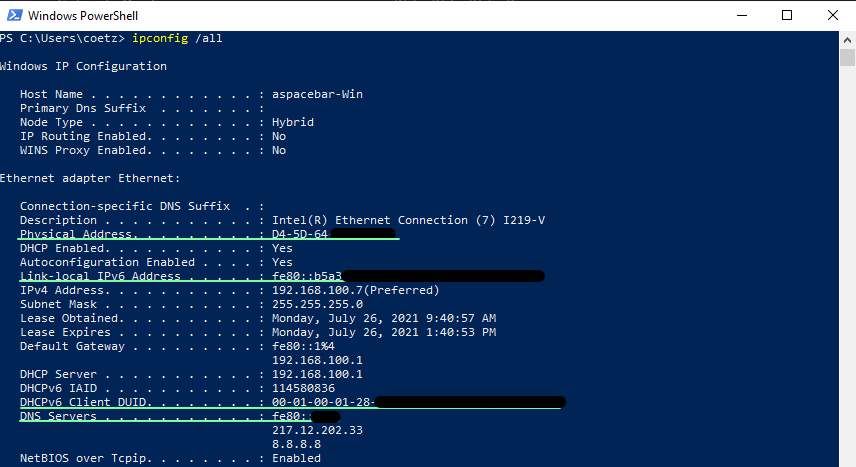
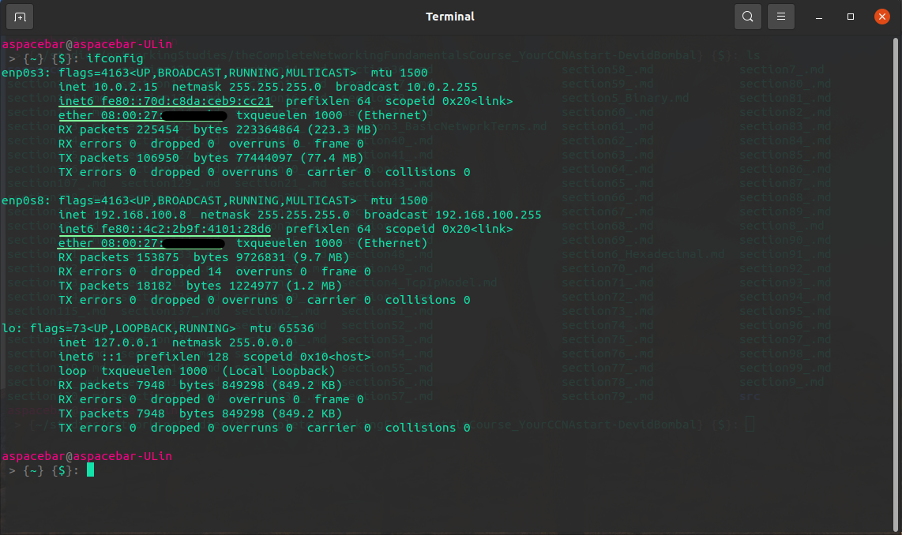
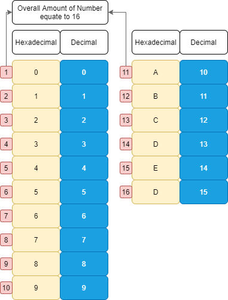
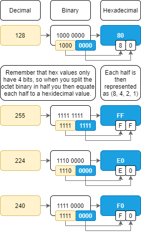

###### - Hexadecimal

<!-- Table Of Contents -->

### Table Of Contents
- [Hexadecimal and Why We Care](#hexadecimal-and-why-we-care)
    - [Hidden MAC Address](#hidden-mac-address)
- [Hexadecimal Lab Demo](#hexadecimal-lab-demo)
- [Hexadecimal Calculations](#hexadecimal-calculations)
    - [Three Numbering Systems](#three-numbering-systems)
    - [Hexadecimal Table](#hexadecimal-table)

 
 

# Hexadecimal and Why We Care
* Hexadecimal is used in Networking all over the place.
    * MAC Addresses
    * IPv6
        * IPv6 Examples:
        * FE0::1
        * 2001::123/64
* Below showcases why learning how to work with hexadecimal is important.
 

 

* Above is Windows, using ipconfig /all to see both the MAC Address and IPv6, You see a few hexadecimal Values within the prompt.

 

 

* Above is Linux, using ifconfig -a to see both the MAC Address known as ether and IPv6 known as inet6, You see a few hexadecimal Values within the prompt.

 

## Hidden MAC Address
* You will notice that, some addresses are hidden in the pictures above, all though they are virtual machines and don't need to be hidden, its done only to explain, That MAC addresses is unique to a device.
* The first half of a MAC address is typically the Manufacturers Organizationally Unique Identifier or OUI
    * The Second half is a unique number.

# Hexadecimal Lab Demo
* In this lab demonstration, we showcase how hexadecimal is used in networking with the use of MAC addresses
* Some information to know
    * In ethernet, devices have MAC addresses allocated to them by the vendor, So in order for one computer to speak to another, they need to know their MAC address, so a computer typically sends a arp packet on layer 3 which we know is network and the PDU for layer 3 is packets, arp is part of the IPv6 protocol stack and stands for Address Resolution Protocol, this basically finds the MAC address of devices on a network.
    * MAC Addresses are also 48 Bits longs
        * as an example, 00c0.1111.1111
    * We also show how switches learn MAC addresses on a network, with MAC address table functionailty, this is because switches need to know on what port to send data through for what mac address instead of just flooding the device. 
        * Devices also have the what is known as a ACL or Access Control List which uses Binary to allow or deny devices on networks. So its important to understand how Hexadecimal is converted into binary.
    * A hex value is 4 Binary bits, 
        * know that a MAC address consists of 6 Hexadecimal values that is the OUI and 6 Hexadecimal values which is the Unique Identifier.

 

 

# Hexadecimal Calculations
## Three Numbering Systems
* As a Network Engineer, we need to know 3 numbering systems
     * Decimal (Base 10 - Ten Numbers)
        * 0, 1, 2, 3, 4, 5, 6, 7, 8, 9
    * Binary (Base 2 - Two Numbers)
        * 0 or 1
    * Hexadecimal (Base 16 - Sixteen Numbers)
        *  0, 1, 2, 3, 4, 5, 6, 7, 8, 9, A, B, C, D, E, F

## Hexadecimal Table

 

 

* The image above shows how Decimal and Hexadecimal correlate with one another, although the graphs are seperate, it is only done like that for explaining purposes. The most important here is seeing and understanding that there are infact 16 numbers, they start from 0 and from 10 to 15 the numbers correlate with letters. 
    * 0 to 9 in hex = 0 to 9 in decimal
    * A to F in hex = 10 to 15 in decimal

 

 

* Above we have added the binary eqivalent as well. You will notice that there are only 4 binary bits when it comes to hexadecimal. This is due to the fact that the highest number in hexadecimal is 15 and that correlates to 4 binary 1's as so 1111.

 

 

* The table above, shows how one goes from decimal to binary to hexadecimal. 
    * We know that in networking Binary is considered to have an octet, such as IPv4 has 4 Octets with the hishest binary weight of 128 bits
* In hexadecimal the highest Binary weight is 8 (8, 4, 2, 1), Thats not to say its the highest number, which is 15 or F.
* So when converting Decimal to Binary, One can convert that to base 2 numeral system and split the octet and then take each half and correlate it to the hex value.

