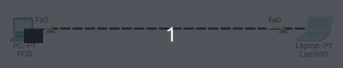
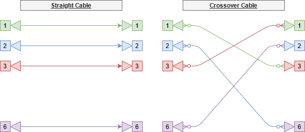
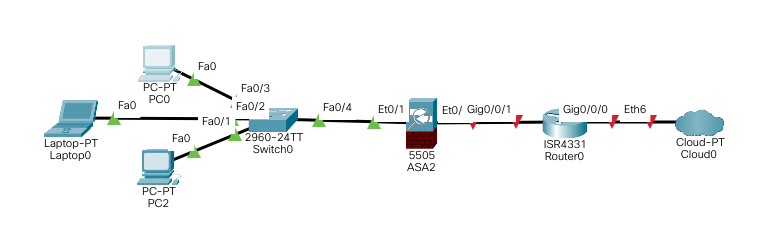

###### ____.BasicNetworkTerms

 

<!-- Table of Contents -->

### Table of Contents
- [What is a network](#what-is-a-network)
    - [Small description](#small-description)
    - [Summary of What is a network?](#summary-of-what-is-a-network)
- [Most basic type of network](#most-basic-type-of-network)
    - [NIC](#nic)
    - [MAC](#mac)
    - [Summary of basic type of network](#summary-of-basic-type-of-network)
- [Servers, Clients, Ports and Protocals](#servers-clients-ports-and-protocals)
    - [What is a server?](#what-is-a-server)
    - [What is a client?](#what-is-a-client)
    - [Network Automation & Network Programmability](#network-automation-and-network-programmability)
    - [What are Protocal & Ports?](#what-are-protocals-and-ports)
    - [Summary of Servers, Clients, Ports and Protocals](#summary-of-servers-clients-ports-and-protocals)
- [Practical Demonstration Of A Network using Packet Tracer](#practical-demonstration-of-a-network-using-packet-tracer)
- [Networking Devices Part 1](#networking-devices-part-1)
    - [Repeaters](#repeaters)
    - [Hubs](#hubs)
    - [Switches](#switches)
    - [Routers](#routers)
    - [Bridges](#bridges)
- [Networking Devices Part 2](#networking-devices-part-2)
    - [Firewalls](#firewalls)
    - [IDS](#ids)
    - [IPS](#ips)
    - [WLC](#wlc)

 
 
 
 

## What is a network?
### Small description
* A computer network is a digital telecommunications network for sharing resources between nodes, which are computing devices that use a common telecommunications technology.
* Data transmission between nodes is supported over data links consisting of physical cable media, such as twisted pair or fibre-optic cables, or by wireless methods, such as Wi-Fi, microwave transmission, or free-space optical communication.

### Summary of What is a network?

> The idea of a network is rather than having to physically transport a file via a usb drive, floppy or whatever other physical medium via sneakernet, we use a cable or some type of mechanism to transmit data from one device to another or from one device to many devices.

 

## Most basic type of network

* The biggest network we know of today is the internet. 
* Now a network doesnt have to be very big to be considered a network, it can be as simple as consisting of only 2 computers or devices as an example.

* The image above displays the most basic of networks whereby it uses an unshielded twisted pair copper (UTP) cable with a RJ45 connector that connects directly into the network interface card or NIC for short. 
* You can achieve the same output with a wireless device such as wifi or bluetooth, It doesnt have to be a physical cable such as UTP or Fiber for instance.
    * The only difference being that wireless modulates a file in the air, which is then sent across through airwaves, from one device to another and the recieving device demodulates it and create the file.

### NIC
#### or Network interface card
* A Network interface card or NIC is how we connect to a physical network, or wireless.
    * Its basically a card that is either inserted into a laptop externally via a usb to rj45 convertor or computer, or its already built into the device, such as a phone or tablet.

### MAC 
#### or Media Access Control
* A network interface card, has what is known as a MAC Address or Media Access Control Address.
* On ethernet, which is the technology we generally use or wireless, devices are known by their MAC address and that is how ethernet can identify devices on a network.

### Summary of basic type of network
    
> The most basic of network can consist of only 2 devices. It can range from physical to wireless.

 

## Servers, Clients, Ports and Protocals
### What is a server?
* In computing, a server is a computer program or a device that provides functionality for other programs or devices, called "clients".
* This architecture is called the client–server model, and a single overall computation is distributed across multiple processes or devices for instance a website is distributed to many clients, hence a single service distributed over multiple processes or devices.

### What is a client?
* A client is a piece of computer hardware or software that accesses a service made available by a server.
* The server is often (but not always) on another computer system, in which case the client accesses the service by way of a network.
    * You dont need a server to provide a service, you can use the client machine to host a service, for example sharing a file with another pc, therefor hosting a file sharing service.

### Network Automation and Network Programmability 
### Very short description
* You basically have one program providing a service to another program typically using what is known as an API or Application Programming Interface.

### What are Protocals and Ports?
* Protocals are basically a set of rules used for communication between a set of devices, and a machine has to listen on certain port numbers for specific protocals, becaue unlike humans, computers need a very structured way of communicating which is why we use ports.
    *  As a example, a server is listening on port 80 knows the language http, your browser is already configured to talk on port 80 and therefor the server knows how to communicate with your browser based on packet based comminication.
* There various ports for different operations, as an example port 21 is for ftp or File Trasnfer Protocal, and port 22 is for ssh or secure shell.
* Overall a single server can run multiple services and provide multiple services to clients based on the protocal.

### Summary of Servers, Clients, Ports and Protocals
    
> Lets begin with the server-client model, A server provides a service to a client. 
> A single server can hold many different services or protocals for a array of clients, as an example a website hosted on a single server can be accessed by 100+ clients at the same time. 
> The server can also have a file transfering protocal or ftp server as well as other services and this is where protcals and ports come into play. 
> Protocals are just how devices communicate to each other based on what the packet being sent is from the client and on what port its being sent to as each port is a different language and unlike humans a computer cannot distinguish between language and therefor is told what to listen for on what ports. 

 

## Practical Demonstration Of A Network using Packet Tracer

 

* In the gif above you see 2 end points being place on your dipology, one being a pc and another being a server.
    * These 2 devices cannot communicate with one another. We need to use either a physical cable or air to connect the 2 devices.
* We then connect the 2 systems with a straight ethernet cable however we we notice that the 2 end points are red, indicating that there is no signal between the 2 devices. 
    * Therefor we need to use what is known as a crossover cable which allows to devices to speak to one another directly. In todays world we use what is know as MDI-X which will be discussed at a later time.
    * Here is a example of a straight ethernet cable and a crossover cable.

 

 

* Once that has been done we go into the pc device on the dipology and run a command within cmd or command prompt **_ipconfig /all_**to see the current ip, we notice there is no ip setup and therefor create one. 
* We also went ahead and changed the MAC address for this example to later show how the packets sent go from one device to another on the said layer.
* We then run the command again and see that the ip, subnet mask and mac were changed and proceed to do the same for the server.
* We change the mode to simulation, and proceed to ping the server.
* This is where we see the packet being sent via an envelope symbol.
* We then check the server to see the services running and proceed to test that on the pc.

 

## Networking Devices Part 1
### Repeaters
* Repeaters only amplify a signal, it doesnt know what is going on, unlike a switch. In the past 10base5 or 10base2 cables signal used to attenuate the longer it became, and therefor you needed a repeater to amplify or boost the signal.

### Hubs
* Hubs or Multiport repeaters on the other hand were the same as repeaters though they incorporated RJ45 connectors, they did the same thing except had a lot more ports but still were dumb. 
    * Unlike switches they did not have intelligence such as mac address tables. So if one port received specific frames or data, it would flood it through all the available ports on a hub.
* Issues were that the more devices connected on a hub, depending on how many people connected, would cause collisions. 
* Although hubs are no longer needed, you do still get hubs in the form of wireless access points.
* Hubs are layer 1 devices.

### Switches
* Although the devices look the same as a hub, the big difference between them is that a switch has intelligence.
* A switch essentially reads what are known as frames when you send data over the ethernet, that is read as frames by the switch.
    * So a switch uses what is known as a mac address table, this allows the switch to receive frames and they have the intelligence to only forward them out of the correct port. It learns where a specific mac address is on the ports and only sends the relavent frames to that specific mac address and it works on layer 2.
* switches allowed us to connected many devices in our local area network. Essentially used to send data over a LAN (Local Area Network).
* Switches work with MAC addresses and over what is known as layer 2 in the OSI model or TCPIP model.

### Bridges
* What about bridges?
    * First you had Repeaters, then hubs, then bridges and bridges were essentially switches though it did things through software. then you got Switches which were rebranded from bridges though it learnt MAC addresses much more quickly by using hardware ASICs (Application Specific Intergrated Circuits).

### Routers
* Routers allow you to route onto other networks, typically a router would allow you to go from your ethernet LAN or local area network to the internet to what is known as WAN or Wide Area Network. 
    * In its most simple form, routers allow you to go from one ip address to another. 
        * You could also route from ethernet to serial in the old days, or from ipv4 to ipv6.
* Routers use IP address and are layer 3 devices.

 

## Networking Devices Part 2
### Firewalls
* Firewalls help us stop bad people from entering the network, you can restrict who can and cannot access by what is known as firewall rules.
* Now you get firewalls on your operating software, as well as your router has a built in firewall, however you also get something called a dedicated firewall, which its only purpose is to act as a firewall. 
* A firewalls can sit either infront of you Router or behind.
    * Some ISP require access to your router so in that case its best to place it behind the router.
* A typical setup would be that the ethernet connects to a router, then to a firewall and then connects to your switch.
    * As an example, the dipology below shows how that would look like.

 

 

### IDS
#### Intrusion Detection System
* IDS is like a dog. Its sniffs an intruder and then barks warning you that you have an attacker and then you need to do something about it.
    * It does not however prevent the intruder from entering, it only warns that there is.
* IDS usually sit out of band of network traffic, so traffic is going past them but they not in the flow of traffic. They just getting copies of the traffic to see if there is a problem.

### IPS
#### Intrusion Prevention System
* IPS however not only warns you that there is an intruder but blocks or stops the intruder.
* IPS sits inline with network traffic, so traffic is going through the IPS, when there is an attack it blocks it.

### WLC
#### Wireless Lan Controller
* A WLC manages WAP devices.
* If you only have a single WAP device, then it would make sense to only manage that device.
    * whereas if you had 100 WAP devices, you could see that managing such an amount of devices could become cumbersome and therefor its better to sue a WLC or Wireless Lan Controller for the simplicity of controlling one device that essentially controls the rest.
