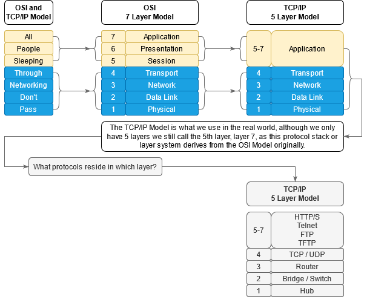
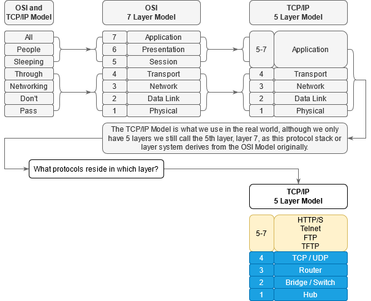
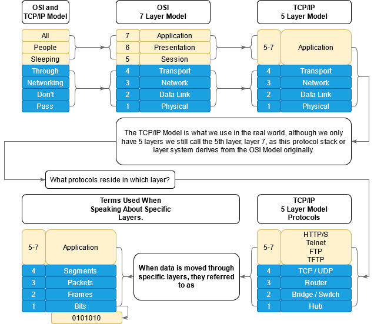
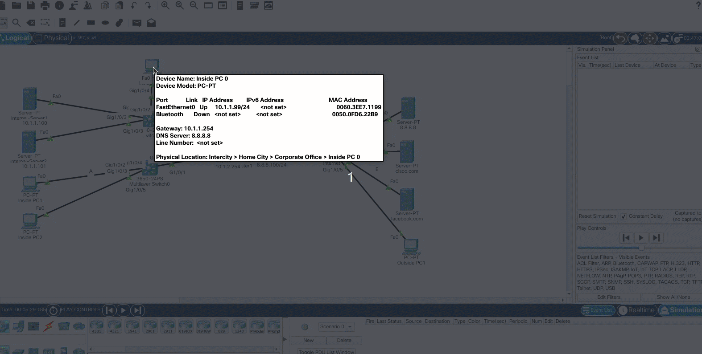
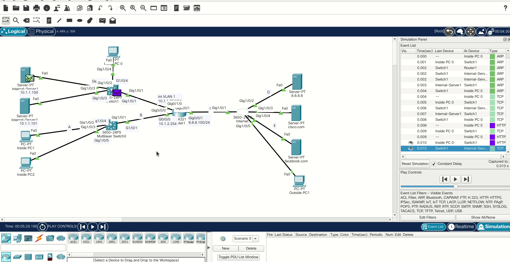

###### ____.TCP/IPModel

 

<!-- Table Of Contents -->

### Table Of Contents
- [OSI and TCPIP Model](#osi-and-tcpip-model)
    - [Open Systems  Interconnection and Transmission Control Protocol & Internet Protocol](#open-systems-interconnection-and-transmission-control-protocol-and-internet-protocol)
    - [What Protocols Reside In Which Layer?](#what-protocols-reside-in-which-layer)
- [Practical TCPIP Model Part 1](#practical-tcpip-model-part-1)
    - [IP](#ip)
    - [Bits](#bits)
- [Practical TCPIP Model Part 2](#practical-tcpip-model-part-2)
    - [The ARP Packet](#the-arp-packet)
    - [TCP Packet or 3 way hand shake](#tcp-packet-or-3-way-hand-shake)
    - [HTTP Packet](#http-packet)
- 

 
 

# OSI and TCPIP Model
## Open Systems Interconnection and Transmission Control Protocol and Internet Protocol
* How many layers are in networking?
    * what are they and why are they important?
* Below show a depictition of what is know as the OSI and or TCP/IP Model system.

 

 

* The OSi Model and TCP/IP Model are taking what is known as a Protocol Stack and neatly organising them on there own layer.
    * Note that its not always as clear cut as what the image above makes it seem, especially in the OSI or Open System Interconnection model makes it seem.
* Getting to why we have models, is because we taking complex problems and breaking them up into small pieces.
* The layers we as networking people concentrate on are the lower 4 layers, or otherwise known as
    * Transport
    * Network
    * Data Link
    * Physical
* Note that the TCP/IP Model is the more realistic model now a days, though looking at the OSI and TCP/IP models, you will notice that the TCP/IP Model combines layers 5 to 7 as Applications however it is still known as Layer 7 even though the TCP/IP Model only has 5 Layers.
    * This is partly due to convention but also because the combining the OSI model into the TCP/IP model.
* So reittereating as networkers we focus on the first 4 layers and then layer 7 which is the combined applications layer.

## What Protocols Reside In Which Layer?

 

 

# Practical TCPIP Model Part 1
## Bits, Frames, Packets, Segments and More

## IP
* An ip address is a number you give a device to allow it to communicate through a protocol such IP or Internet Protocol, as an example connecting to you home router with an ip address, essentially a device.

* There is some terms when it comes to talking about "stuff" on specific layers in the TCP/IP Model shown in the image below.
        
 

 

## Bits
* When sending data on the physical layer, we sending 0s and 1s known as **_Bits_**. 
        * So the bits of data on a fiber cable is represented as light. 
            * --> If there is light its a 1 if there is no light its a 0, 
        * Whereas the bits of data on a copper cable is represented as electricity.
            * --> If there is electricity then its a 1, If there is no electricity then its a 0
        * so 0s and 1s would represent our bits, or binary values.

 

# Practical TCPIP Model Part 2
## HTTP captures

## The ARP Packet
* In our dipology we trying to connect to a server with an ip address of 10.1.1.100, before we can establish a connection with the specified ip address in our local network, we need do what is known as an Address Resolution Protocol or ARP. 
    * In the gif below we see that we entered th ip address in our client browser and the ARP frame was created.

 

 

 

* The purpose of ARP is to understand to which device the client pc need to connects to.
    * Its basically requesting the MAC Address of the server we trying to connect to, So in other words its asking which MAC Address has this ip?
* That frame gets sent to the switch as seen below

 

 

* So that request gets sent to the switch which is a layer 2 device, 
    * Notice the destination is FFFF.FFFF.FFFF which is known as a broadcast and is a layer 2 frame, that gets sent to the switch which is again a layer 2 device and that requests then basically floods the device or ports requesting that ip address.
* When looking at the PDU or Protocol Data Unit, we see that Target MAC Address is 0000.0000.0000 and the Target IP Address is 10.1.1.100.
* The broadcast floods the layer 2 device in other words the switch and when looking at the Router which has an IP of (10.1.2.254/24) and Server 2 (10.1.1.101) both drop the packet.
    * Whereas Server 1 will reply back.
* When looking at Server 1 The inbound PDU shows the broadcast packet FFFF.FFFF.FFFF from the client pc, though the outbound PDU now shows the is from the server with said MAC address replying to the client PC.
    * That then gets sent back to the switch and from the switch back to the client pc. The client pc now knows the mac address of the server.

## TCP Packet or 3 way hand shake
* After the ARP Request has been made, it then sends out a TCP packet.
* In TCP before any communication takes place, they do what is called a 3 way handshake as seen below

 

 

* Basically they are agreeing on certain parameters such as sequence numbers or how much data they can send and then a HTTP Packet is sent into the network.

## HTTP Packet
* When looking at the HTTP packet, we see a specific interface recieves that frame gig1/0/4 and the is then forwarded out gig1/0/2.

 

 

* We then look at the Inbouned PDU and see  the source address and the destination address, we also see something called TYPE:0x0800 and that brings us to the question of, How does one layer communicate with another?
    * So at layer 2 on ethernet it uses a what is known as a TYPE field followed by a hexadecimal such as 0x0800 or 0x0806.
* The hexadecimal number 0x0800 seen in the PDU TYPE field is indicating that the higher layer protocol is IPv4 or located in the IPv4 protocol stack.
    * We can have other protocol stacks as well, as an example, if we go back and look at the ARP Request you will see that the TYPE field is 0x0806 which indicates that the higher protocol layer can be found in the IPv6 protocol stack.
* When a device recieves a frame at layer 2 it needs to know which protocol to use. In other words which protocol stack to use.
* When the Server receives the HTTP packet, it will know that it needs to use the IPv4 Protocol Stack based on the TYPE field.
* In this example, The TYPE:0x0800 or IPv4 is the layer 3 protocol.
    * And you can see the IPv4 source and destination ip address.
* Now we repeat the question again, How does it know which protocol is being used at layer 4, 
    * ethernet was the layer 2 encapsulation.
    * IPv4 Was the layer 3 Protocol.
    * TCP is the layer 4 Protocol.
        * An we know this because we see the PRO:0x06 hexadecimal number
            * You can see more IPv4 Protocols [Here](https://www.iana.org/assignments/protocol-numbers/protocol-numbers.xhtml "IPv4 Protocol List")

 

# Practical TCPIP Model Part 3

 

# Practical TCPIP Model Part 4