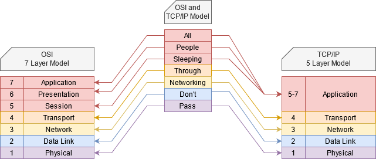

###### ____.TCP/IPModel

 

<!-- Table Of Contents -->

### Table Of Contents
- [OSI and TCPIP Model](#osi-and-tcpip-model)
    - [Open Systems  Interconnection and Transmission Control Protocal & Internet Protocal](#open-systems-interconnection-and-transmission-control-protocal-and-internet-protocal)
- 
- 
- 
- 

 
 

## OSI and TCPIP Model
### Open Systems Interconnection and Transmission Control Protocal and Internet Protocal

* How many layers are in networking?
    * what are they and why are they important?
* Below show a depictition of what is know as the OSI and or TCP/IP Model system.

 

 

* The OSi Model and TCP/IP Model are taking what is known as a Protocal Stack and neatly organising them on there own layer.
    * Note that its not always as clear cut as what the image above makes it seem, especially in the OSI or Open System Interconnection model makes it seem.
* Getting to why we have models, is because we taking complex problems and breaking them up into small pieces.
* The layers we as networking people concentrate on are the lower 4 layers, or otherwise known as
    * Transport
    * Network
    * Data Link
    * Physical
* Note that the TCP/IP Model is the more realistic model now a days, though looking at the OSI and TCP/IP models, you will notice that the TCP/IP Model combines layers 5 to 7 as Applications however it is still known as Layer 7 even though the TCP/IP Model only has 5 Layers.
    * This is partly due to convention but also because the combining the OSI model into the TCP/IP model.
* So reittereating as networkers we focus on the first 4 layers and then layer 7 which is the combined applications layer.