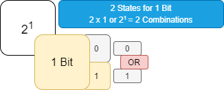
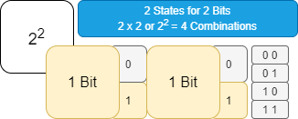
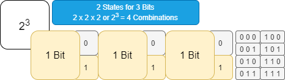
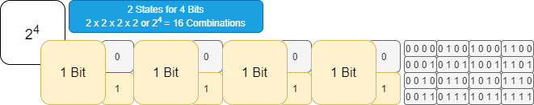
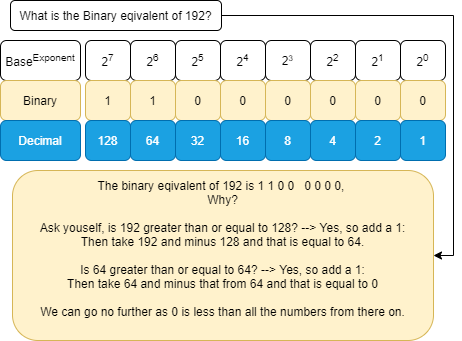
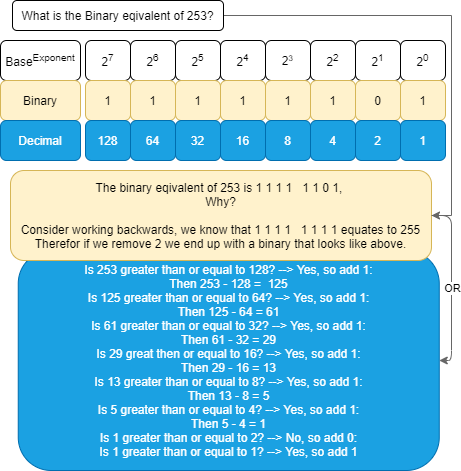
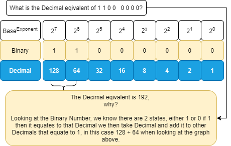
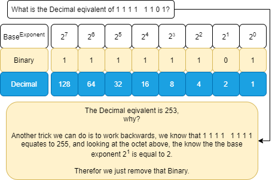
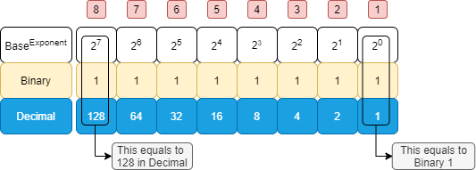

###### ____.Binary

 

<!-- Table Of Contents -->

### Table Of Contents

- [Binary Introduction](#binary-introduction)
    - [What Is A Binary Number](#what-is-a-binary-number)
- [Binary Math](#binary-math)
- [Binary Conversion Example](#binary-conversion-example)
    - [What is the Binary eqivalent to 192](#what-is-the-binary-eqivalent-to-192)
    - [What is the Binary eqivalent to 253](#what-is-the-binary-eqivalent-to-253)
    - [What is the Deciaml eqivalent to 1 1 0 0   0 0 0 0](#what-is-the-deciaml-eqivalent-to-1-1-0-0-0-0-0-0)
    - [What is the Deciaml eqivalent to 1 1 1 1 1 1 0 1](#what-is-the-deciaml-eqivalent-to-1-1-1-1-1-1-0-1)
- [Converting IP Addresses to Binary](#converting-ip-addresses-to-binary)
    - [IPv4 Octet Table](#ipv4-octet-table)
    - 
- 
- 

 
 

# Binary Introduction 
* Binary is a building block in networks today. Its used in multiple places such as:
    * Access Lists or Access Control Lists
        * which allow you to permit or deny various devices on your network.
        * You do this by matching specific ip addresses by their binary number.
    * Supnetting, or supnet mask.

## What Is A Binary Number
* We learn that a Binary Number is part of the base 2 numeral system or binary numeral system, which is essentially a method of mathematical expression which uses only two symbols 1 or 0 where we use the base 10 number system. 
    * This in computer electronics equates to devices having 2 states, on or off, though in binary on is 1 and off is 0.
* Each Bit has 2 States and that bit is then used as an exponent against the 2 states giving us the result of a decimal number which equates to the amount of combinations that that bit has.

# Binary Math

 

* 2 x 1 21 = Decimal Number 2 and amount of Combinations which is either 1 or 0

 

* 2 x 2 22 = Decimal Number 4 and amount of Combinations

 

* 2 x 3 23 = Decimal Number 8 and amount of Combinations

 

* 2 x 4 24 = Decimal Number 16 and amount of Combinations

 

* 2 to the power of 0 20 = 1
* 2 to the power of 1 21
    * which is 2 multiplied together 1 time 2x1 = 2 Bits
* 2 to the power of 2 22
    * which is 2 multiplied together 2 times 2x2 = 4 Bits
* 2 to the power of 3 **23**
    * which is 2 multiplied together 3 times 2x2x2 = 8 Bits
* 2 to the power of 4 24
    * which is 2 multiplied together 4 time 2x2x2x2 = 16 Bits
* 2 to the power of 5 25
    * which is 2 multiplied together 5 time 2x2x2x2x2 = 32 Bits
* 2 to the power of 6 26
    * which is 2 multiplied together 6 time 2x2x2x2x2x2 = 64 Bits
* 2 to the power of 7 27
    * which is 2 multiplied together 7 time 2x2x2x2x2x2x2 = 128 Bits
* 2 to the power of 8 28
    * which is 2 multiplied together 8 time 2x2x2x2x2x2x2x2 = 256 Bits

# Binary Conversion Example

## What is the Binary eqivalent to 192

 

## What is the Binary eqivalent to 253

 

## What is the Deciaml eqivalent to 1 1 0 0   0 0 0 0

 

## What is the Deciaml eqivalent to 1 1 1 1 1 1 0 1

 

# Converting IP Addresses to Binary
## IPv4 Octet Table

 

 