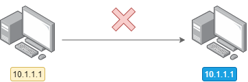
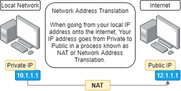

###### ____.IPAddressing

<!-- Table Of Contents -->

### Table Of Contents
- 
- 
- 
- 
- 
- 
- 

# IP Addressing Overview and Demonstration
* An IP address is a layer 3 logical address assigned by an administrator. 
    * Unlike MAC addresses, which are burnt into the NIC by the manufacturer, an IP address is assigned by an administrator.
 * An IP address may change within a subnet, for example when using DHCP (Dynamic Host Configuration Protocol) 
 * An IP address resides at layer 3 in the OSI or TCP/IP Model
 * IP addresses are used to identify specific devices on a network.
    * and are used by router to determine where that device is.
        * In other words a Router routes traffic to a destination IP address based on a hierarchy.
* Every device on the internet has a unique IP address, Even though there are millions of devices out there, no 2 devices can have the same IP address. (Hence the move to IPv6 now a days because of IPv4 Exhaustion)
    * As an example you cannot have a device with an IP address of 10.1.1.1 communicating with another device with the same ip address 10.1.1.1.

 

 

* Every device on the internet needs their own unique IP address and is required to communicate between devices.
* In the RFC1918 addresses, something like 10.1.1.1 is considered a private IP address.
    * Private IP addresses are used internally and those IP address are then NAT'ed or (Network Address Translated) onto the internet.
        * So when a Private IP address such as 10.1.1.1 gets NAT'ed to a Public IP Address such as 12.1.1.1, then 12.1.1.1 needs to be unique on the internet.
    * Be aware that multiple companies may use the IP address 10.1.1.1 but those addresses are NAT'ed to unique IP address on the internet.

 

 

* Another example is when we ping www.google.com, notice that the Domain Name is translated to an IP address. 
    * In this case google.com is translated by a protocol called DNS or (Domain Name Service).
    * DNS is used to convert easy to read name to IP addresses.
        * Its much easier to remember  names such as google, rather than numbers.
* lets see an example

 

 

* The most important here is that we see that when we ping a website, that DNS is doing the name resolution of the domain name, in other words its resolving a Domain name to an IP address.
    * Although in this demonstration we didn't see it a timedout message. There are some websites that do not permit you to ping it.
* Another thing to take note of is the first octet of the IP usually belongs to to that company, for example 172 would belong to google.

# IP Characteristics and IPv4 Address Format
* To reiterate each website is resolved to a different IP address, again DNS is doing the name resolution. Thats how we find out what the IP address is.
    * You can ping many of the well known websites to find out what the IP addresses are, or you can use what is known as nslookup 
        * nslookup only does a DNS Resolution of a Domain name, Instead of pinging it.

 

* In summary take note that every device has an IP address, including our own machine
    * We can see this by typing the command ipconfig on Windows or ifconfig on Linux

 

 

* In the gif above, my IPv4 address is 10.0.2.15
    * We also have what is known as IPv6 addresses as that is becoming more and more popular due to IPv4 Exhaustion.
        * The is represented as inet6...
