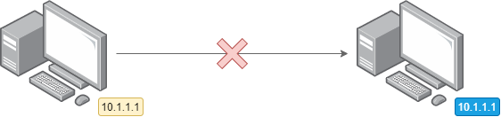
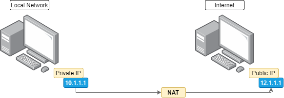
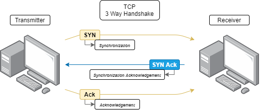
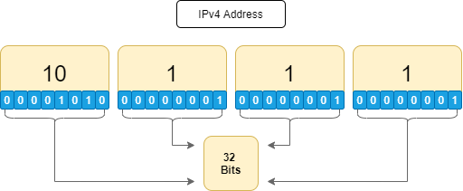

###### - IPAddressing

<!-- Table Of Contents -->

### Table Of Contents
- 
- 
- 
- 
- 
- 
- 

# IP Addressing Overview and Demonstration
* An IP address is a layer 3 logical address assigned by an administrator. 
    * Unlike MAC addresses, which are burnt into the NIC by the manufacturer, an IP address is assigned by an administrator.
 * An IP address may change within a subnet, for example when using DHCP (Dynamic Host Configuration Protocol) 
 * An IP address resides at layer 3 in the OSI or TCP/IP Model
 * IP addresses are used to identify specific devices on a network.
    * and are used by router to determine where that device is.
        * In other words a Router routes traffic to a destination IP address based on a hierarchy.
* Every device on the internet has a unique IP address, Even though there are millions of devices out there, no 2 devices can have the same IP address. (Hence the move to IPv6 now a days because of IPv4 Exhaustion)
    * As an example you cannot have a device with an IP address of 10.1.1.1 communicating with another device with the same ip address 10.1.1.1.

 

 

* Every device on the internet needs their own unique IP address and is required to communicate between devices.
* In the RFC1918 addresses, something like 10.1.1.1 is considered a private IP address.
    * Private IP addresses are used internally and those IP address are then NAT'ed or (Network Address Translated) onto the internet.
        * So when a Private IP address such as 10.1.1.1 gets NAT'ed to a Public IP Address such as 12.1.1.1, then 12.1.1.1 needs to be unique on the internet.
    * Be aware that multiple companies may use the IP address 10.1.1.1 but those addresses are NAT'ed to unique IP address on the internet.

 

 

* Another example is when we ping www.google.com, notice that the Domain Name is translated to an IP address. 
    * In this case google.com is translated by a protocol called DNS or (Domain Name Service).
    * DNS is used to convert easy to read name to IP addresses.
        * Its much easier to remember  names such as google, rather than numbers.
* lets see an example

 

 

* The most important here is that we see that when we ping a website, that DNS is doing the name resolution of the domain name, in other words its resolving a Domain name to an IP address.
    * Although in this demonstration we didn't see it a timedout message. There are some websites that do not permit you to ping it.
* Another thing to take note of is the first octet of the IP usually belongs to to that company, for example 172 would belong to google.

# IP Characteristics and IPv4 Address Format
* To reiterate each website is resolved to a different IP address, again DNS is doing the name resolution. Thats how we find out what the IP address is.
    * You can ping many of the well known websites to find out what the IP addresses are, or you can use what is known as nslookup 
        * nslookup only does a DNS Resolution of a Domain name, Instead of pinging it.

 

* In summary take note that every device has an IP address, including our own machine
    * We can see this by typing the command ipconfig on Windows or ifconfig on Linux

 

 

* In the gif above, my IPv4 address is 10.0.2.15
    * We also have what is known as IPv6 addresses as that is becoming more and more popular due to IPv4 Exhaustion.
        * The is represented as inet6...

## IP Characteristics
## IPv4 
* Is at layer 3 or the network layer protocol
* IPv4 is a connectionless protocol, in other words, there are no sessions formed when using IP, The transmitter simply sends data without notification to the receiver. No Status information is sent back either from the receiver. Its totally connectionless.
    * TCP on the other hand is connection oriented, TCP will setup a session so that before transmission takes place, In TCP the Transmitter will send to the receiver what is known as a SYN or (Synchronization Message), the receiver then sends back a SYN Ack or (Synchronization Acknowledgement Message), and then the transmitter returns a Ack or (Acknowledgement Message) to the receiver.
        * This is known as the 3 Way Handshake
* Diagram of a 3 way handshake

 

 

* IP doesn't do any of that!
    * Each packet in IP is treated independently of other packets.
    * That is way traffic can take different paths to get to a destination.
* Routers will route traffic via different paths based on options such as 
    * Load Balancing (because each packet is independent and IP is a connectionless protocol)
* Router can also base routing decisions on different values such as 
    * (OSPF) Bandwidth
    * (RIP) Hopcount
    * However it is possible that packets from one session take different paths or divergent paths to get to a destination. For example
        * RIP will base its routing decision on Hopcount (Which is not good and hence RIP is not used that often)
        * OSPF Will base its routing decision on Bandwidth
            * Other routing protocols will use its own metrics to determine the best path.
    * A Routing Protocol determines the best path or best route from A to B
        * This is based on the hierarchical addressing structure in IPv4 and IPv6 Where we have both a Network and Host Portion as part of the address.
    * Routers base their routing decision on the Network Portion of the address rather than the Host Portion.
* IP also only gives best effort delivery of packets
    * There is no guarantee of packet delivery, any packet could misdirected, it could be duplicated or it could be lost in transmission when sent to a destination. That should be expected in IP transmission.
        * Once again TCP which is a connection orientated protocol has the ability to retransmit packets that go missing, where as UDP another layer 4 protocol doesn't retransmit missing packets, if they get dropped they are simple lost and then the applications need to take care of that.
* IP also has no data recovery features. If the packet gets corrupted the end devices need to handle that and not the routers in between.

## Summary
* IP has no Built in sessions
    * Has no retransmissions
    * No Data Recovery
* Higher layers such as TCP handle dropped, corrupted or misdirected packets. IP does not provide those feature and relies on Higher lyaer protocol to provide those features.

## Format Overview
## IPv4 Address
* An IPv4 address is 32 Bits in size and normally written in what is known as dotted decimal format
    * x.x.x.x or 10.1.1.1
        * Each decimal is 8 bits long. This is also known as an octet.

 

 

* IP address once again have an hierarchical structure to enable routing. Which consist of 2 main parts
    * Network Portion of the IP address
    * Host Portion of the IP address
* IP addresses are used for routing in a very similar way as DHL or Fedex route parcels based on a destination address
    * Routers will route traffic to a destination address when unicast packets are transmitted.
        * multicast packets use a different mechanism and do their routing based on source address.

