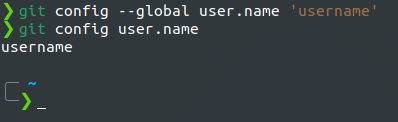
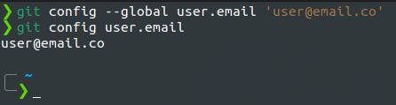

###### - section3_Installation&Setup

 

<!-- Section Header -->

<!-- Table of Contents -->

### **Table of Contents**

+ [Configuring your Git name and email](#configuring-your-git-name-and-email)
    - [Git Name Configure](#git-name-configure)
    - [git Email Configure](#git-email-configure)

## **Configuring your Git name and email**

 
 

## **Git Name Configure**

* **git config --global user.name 'username'**
Configuring your git credential username.

* **git config user.name**
Prints current configured username credential.

 
 

### **Example**

 
 

 
 

## **Git Email Configure**

 
 

* **git config --global user.email 'user@email.co'**
Configuring your git credential email.

* **git config user.email**
Prints current configured username credential.

 
 

### **Example**

 
 

 
 

<!-- End of Document -->

